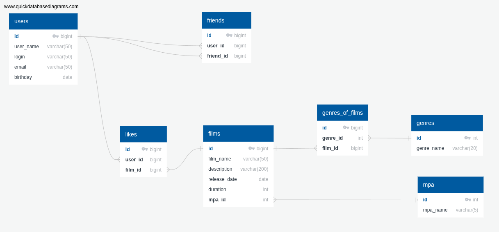

# java-filmorate
The Filmorate project.

### Database map


### Database requests examples

1. Get TOP-10 films:
```sql
SELECT f.film_name,
       sum(l.user_id) AS rate
FROM films f
         JOIN likes l ON f.id = l.film_id
GROUP BY f.film_name
ORDER BY rate DESC
    LIMIT 10;
```

2. Get all the movies liked by users 5, 6 and 7 with a
   duration of more than 100 minutes and with genres of
   adventure, horror, action.
```sql
SELECT f.film_name,
       f.release_date,
       f.duration
FROM films f
WHERE f.id IN
      (SELECT l.film_id
       FROM likes l
       WHERE l.user_id IN
             (SELECT friend_id
              FROM friends fr
              WHERE fr.user_id IN (5, 6, 7)
             )
      )
  AND f.duration > 100
  AND f.id IN
      (SELECT fg.film_id
       FROM genres_of_films fg
       WHERE fg.genre_id IN
             (SELECT g.id
              FROM genres g
              WHERE g.genre_name
                       IN('Боевик', 'Триллер', 'Комедия')
             )
      );
```
